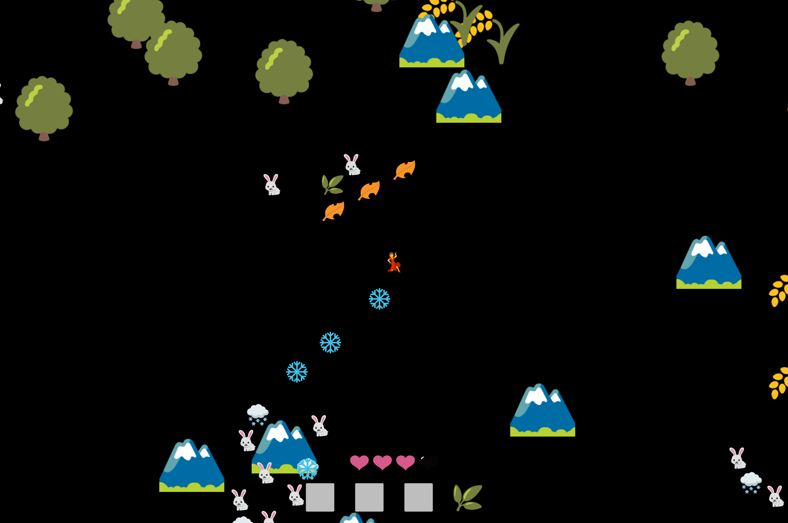
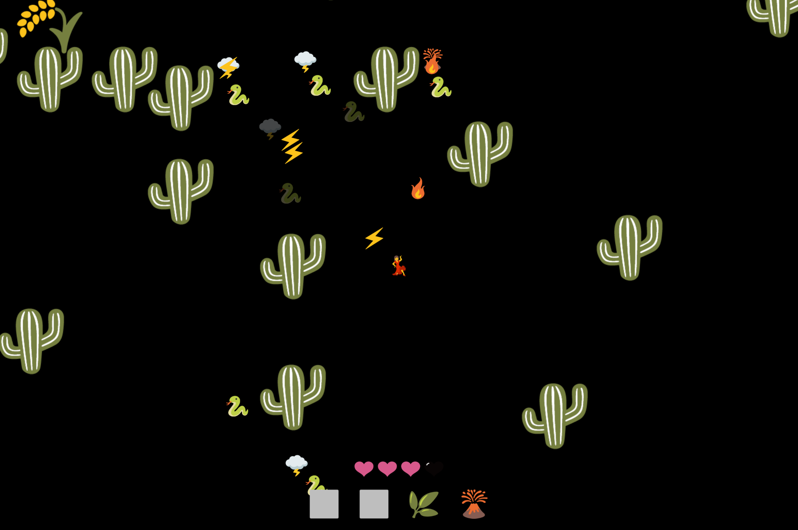
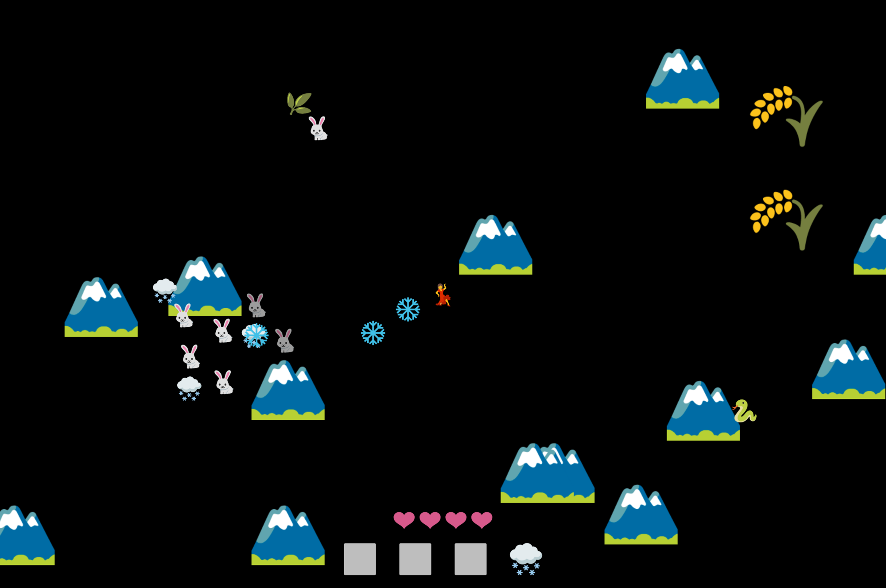
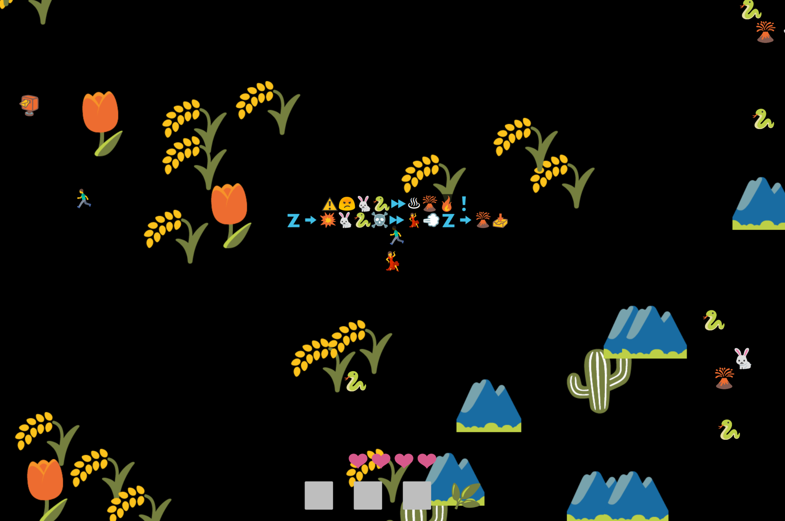
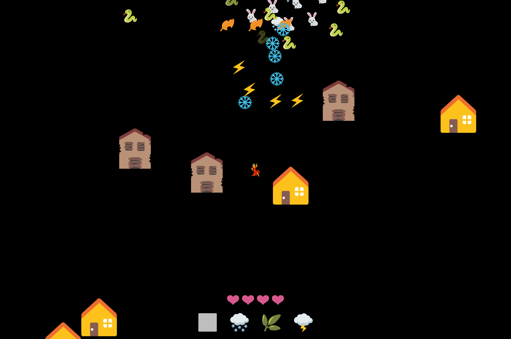

# Emoji Game

🎮✏️🚫🔤

A quick game made entirely of emoji. No text allowed.

[Play in Browser](https://willy-vvu.github.io/EmojiGame/)

Use Arrow Keys to move, Z to Attack/Collect items, and X to Drop/Reorder Items.

Pays homage to ASCII art games, while inviting inquiry about Emoji, its uses, and its relation to written language.

---

## Behind the Scenes

I collected my keystrokes while I wrote this project, which I visualized in [another final project](https://github.com/willy-vvu/Changes).

---

Assignment for: 21W.764 Word Made Digital (Final Project)

Learning Focus: Game Design, Language and Meaning, Emoji Rendering

Media: Video Game, Website

Software: JavaScript, Vue.js

Date: May 2017
