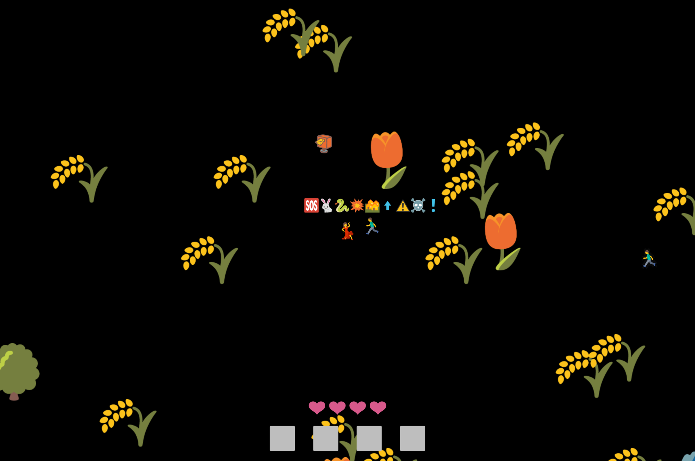

# Emoji Game

🎮✏️🚫🔤

A quick game made entirely of emoji. No text allowed.

[Play in Browser](https://willy-vvu.github.io/EmojiGame/)

Use Arrow Keys to move, Z to Attack/Collect items, and X to Drop/Reorder Items.

Pays homage to ASCII art games, while inviting inquiry about Emoji, its uses, and its relation to written language.

There's actually more than meets the eye than the emoji graphics. The "Elements" of Fire, Electricity, Leaf, and Snow can be collected and equipped to alter the main character's attack. Each element has properties by itself; Leaves split into three projectiles when fired, and Fire deals Area of Effect damage. But like adjectives and nouns, different effects can combine and interact and emergent ways. Equipping "Fire Leaves" unleashes three leaves that each inflict Area of Effect damage. The symbolic nature of emojis and how they are combined into higher-order concepts is rather open-ended, providing a flexibility across the game's programming, visuals, and UI. To discover other combinations and how they work, you'll have to [play the game](https://willy-vvu.github.io/EmojiGame/) (like, what do lighting snowflakes do?).

The enemies in the game are a dynamic system. Rabbits and Snakes work together following some basic swarm logic to defend the "Elements". They stick together in packs, approach the player to do damage, but flee when their health is low. Snakes have more health than rabbits, group more loosely, and exhibit more aggressive behavior. Using these rules, enemies exhibit a few interesting properties: Snakes tend to create an outer "shell", defending the rabbits who in turn protect the elements. Lower health enemies fall back into the swarm, sometimes causing the swarm to "rotate" to provide the best defense. Fleeing one swarm may cause it to pursue you and join with another swarm. The final boss is a great place to see this in action.

The design of the overworld takes inspiration from Legend of Zelda: Breath of the Wild. The final boss sits at the top of the map with four elemental themed areas to the sides and beneath, using oversized landscape emoji to populate the environment. The player can freely explore, purposefully or serendipitously stumbling upon new areas.

*And of course, all the NPC "dialogue" is in emoji too.*

---

## Behind the Scenes

I collected my keystrokes while I wrote this project, which I visualized in [another final project](https://github.com/willy-vvu/Changes).

---

Assignment for: 21W.764 Word Made Digital (Final Project)

Learning Focus: Game Design, Language and Meaning, Emoji Rendering

Media: Video Game, Website

Software: JavaScript, Vue.js

Date: May 2017
